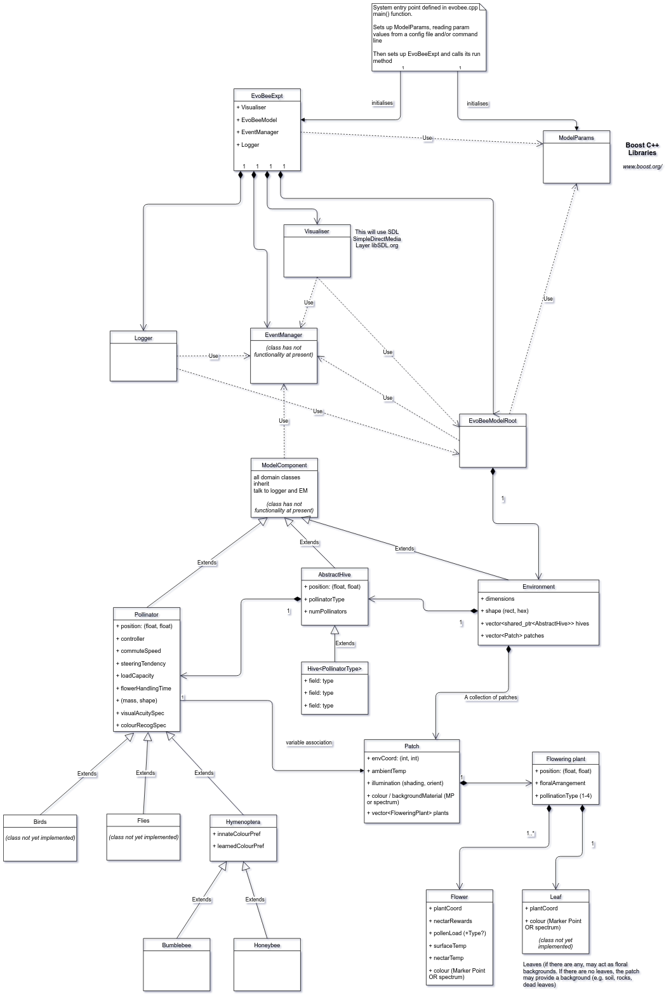

# EvoBee code architecture and documentation

[[ [Return to top-level documentation menu](../../README.md) ]]

## UML diagrams

The following UML diagram gives an overview of the class structure of the code.

|  | 
|--|
| EvoBee class structure |
<!--stackedit_data:
eyJoaXN0b3J5IjpbNjE0NjgzMDc3LC0xNjM4NDQ2NTY4XX0=
-->