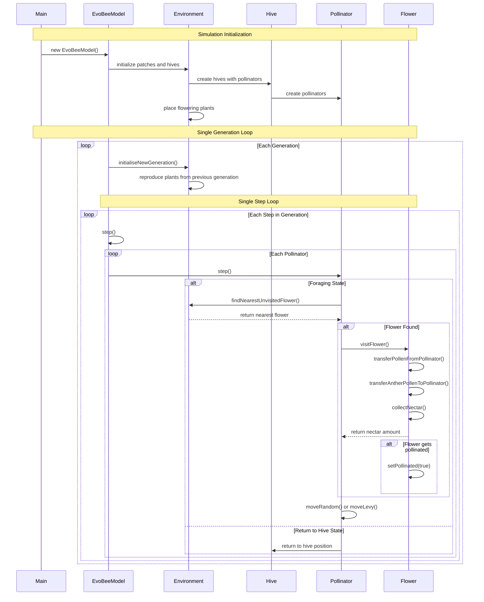

# EvoBee Class Structure UML Diagrams

## 1. Core System Class Diagram

```mermaid
classDiagram
    class EvoBeeModel {
        -unsigned int m_iGen
        -unsigned int m_iStep
        -Environment m_Env
        +static mt19937 m_sRngEngine
        +EvoBeeModel()
        +step()
        +initialiseNewGeneration()
        +getGenNumber() unsigned int
        +getStepNumber() unsigned int
        +getEnv() Environment&
        +static seedRng()
    }

    class Environment {
        -PatchVector m_Patches
        -HivePtrVector m_Hives
        -PollinatorPtrVector m_AllPollinators
        -FlowerPtrVector m_AllFlowers
        -int m_iSizeX, m_iSizeY
        -float m_fSizeX, m_fSizeY
        +Environment(EvoBeeModel* pModel)
        +initialiseNewGeneration()
        +getPatch(int x, int y) Patch&
        +getHives() HivePtrVector&
        +findNearestFloweringPlant() FloweringPlant*
        +findNearestUnvisitedFlower() Flower*
        +getAllPollinators() PollinatorPtrVector&
    }

    class Patch {
        -vector~FloweringPlant~ m_Plants
        -iPos m_Position
        +addPlant(FloweringPlant plant)
        +getPlants() vector~FloweringPlant~&
        +getPosition() iPos
    }

    EvoBeeModel ||--|| Environment : contains
    Environment ||--o{ Patch : manages
    Environment ||--o{ AbstractHive : contains
```

## 2. Pollinator Hierarchy Class Diagram

```mermaid
classDiagram
    class AbstractHive {
        <<abstract>>
        -Environment* m_pEnv
        -fPos m_Position
        -bool m_bStartFromHive
        -iPos m_InitForageAreaTopLeft
        -iPos m_InitForageAreaBottomRight
        -bool m_bMigrationAllowed
        +AbstractHive(Environment* pEnv, HiveConfig& hc)
        +static makeHive() shared_ptr~AbstractHive~
        +getPosition() fPos&
        +getRandomPollinatorStartPosition() fPos
        +getNumPollinators()* int
        +getPollinator(size_t idx)* Pollinator*
        +migrationAllowed() bool
    }

    class Hive~T~ {
        -vector~T~ m_Pollinators
        +Hive(Environment* pEnv, HiveConfig& hc)
        +getNumPollinators() int
        +getPollinator(size_t idx) Pollinator*
    }

    class Pollinator {
        <<abstract>>
        -unsigned int m_id
        -fPos m_Position
        -float m_fHeading
        -AbstractHive* m_pHive
        -Environment* m_pEnv
        -PollinatorState m_State
        -PollenVector m_PollenStore
        -ReflectanceInfo m_TargetReflectance
        +Pollinator(PollinatorConfig& pc, AbstractHive* pHive)
        +step()
        +reset()
        +getPosition() fPos&
        +visitFlower(Flower* pFlower) int
        +getMPDetectionProb(MarkerPoint mp)* float
        +getVisStimulusInfo(MarkerPoint mp)* VisualStimulusInfo&
        #forageRandom()
        #forageNearestFlower()
        #moveRandom()
        #moveLevy()
    }

    class HoneyBee {
        +HoneyBee(PollinatorConfig& pc, AbstractHive* pHive)
        +getMPDetectionProb(MarkerPoint mp) float
        +getVisStimulusInfo(MarkerPoint mp) VisualStimulusInfo&
        +step()
    }

    class Hymenoptera {
        +Hymenoptera(PollinatorConfig& pc, AbstractHive* pHive)
        +getMPDetectionProb(MarkerPoint mp) float
        +getVisStimulusInfo(MarkerPoint mp) VisualStimulusInfo&
    }

    AbstractHive <|-- Hive~T~
    Pollinator <|-- HoneyBee
    Pollinator <|-- Hymenoptera
    AbstractHive ||--o{ Pollinator : manages
    Environment ||--o{ AbstractHive : contains
```

## 3. Plant and Flower Hierarchy Class Diagram

```mermaid
classDiagram
    class FloweringPlant {
        -unsigned int m_id
        -unsigned int m_SpeciesId
        -fPos m_Position
        -vector~Flower~ m_Flowers
        -bool m_bPollinated
        -Patch* m_pPatch
        -PlantTypeConfig* m_pPlantTypeConfig
        +static map~uint,string~ m_sSpeciesMap
        +FloweringPlant(PlantTypeConfig& typeConfig, fPos& pos, Patch* pPatch)
        +FloweringPlant(FloweringPlant* pParent, fPos& pos, Patch* pPatch, bool mutate)
        +static registerSpecies(string& species) uint
        +getId() uint
        +getSpeciesId() uint
        +getFlower(uint flower) Flower*
        +getFlowers() vector~Flower~&
        +pollinated() bool
        +getDistance(fPos& point) float
    }

    class Flower {
        -unsigned int m_id
        -unsigned int m_SpeciesId
        -fPos m_Position
        -ReflectanceInfo m_Reflectance
        -bool m_bPollinated
        -int m_iAntherPollen
        -PollenVector m_StigmaPollen
        -int m_iAvailableNectar
        -FloweringPlant* m_pPlant
        +Flower(FloweringPlant* pPlant, PlantTypeConfig& ptc, fPos& pos, MarkerPoint mp)
        +getId() uint
        +getPosition() fPos&
        +pollinated() bool
        +getSpeciesId() uint
        +getCharacteristicWavelength() Wavelength
        +transferAntherPollenToPollinator() int
        +transferPollenFromPollinator() int
        +collectNectar(int amountRequested) int
    }

    class Pollen {
        -unsigned int m_SpeciesId
        -int m_iLandingCount
        +Pollen(uint speciesId)
        +getSpeciesId() uint
        +incrementLandingCount()
        +getLandingCount() int
    }

    class ReflectanceInfo {
        -Wavelength m_CharacteristicWavelength
        -float m_HexDistance
        +ReflectanceInfo()
        +getCharacteristicWavelength() Wavelength
        +setCharacteristicWavelength(Wavelength lambda)
    }

    FloweringPlant ||--o{ Flower : contains
    Flower ||--o{ Pollen : stigma_contains
    Flower ||--|| ReflectanceInfo : has_visual_properties
    Patch ||--o{ FloweringPlant : contains
```

## 4. Simulation Flow Sequence Diagram



This UML documentation shows:

1. **Core System Structure**: How `EvoBeeModel` manages the `Environment` which contains `Patches`
2. **Pollinator Hierarchy**: Abstract hive system managing different pollinator types
3. **Plant-Flower Relationships**: How plants contain flowers and interact with pollen
4. **Simulation Dynamics**: The sequence of operations during a typical simulation run

Key architectural patterns:
- **Template Pattern**: `Hive<T>` for different pollinator types
- **Strategy Pattern**: Different foraging and movement strategies in `Pollinator`
- **Observer Pattern**: Environment tracking all pollinators and flowers
- **Factory Pattern**: `AbstractHive::makeHive()` creates appropriate hive types